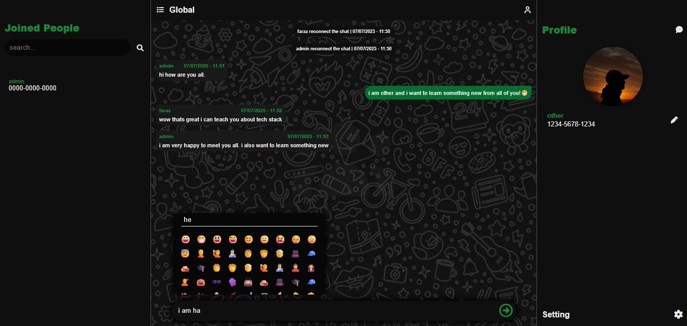
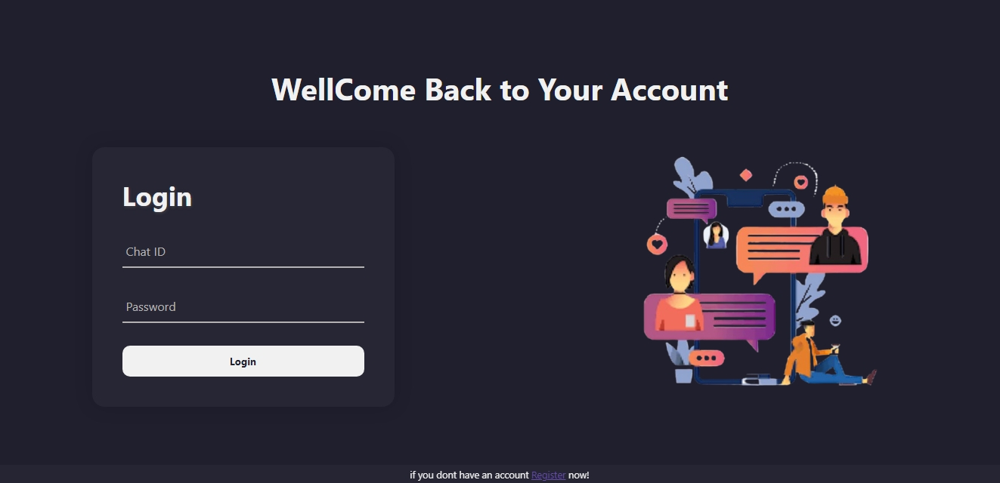
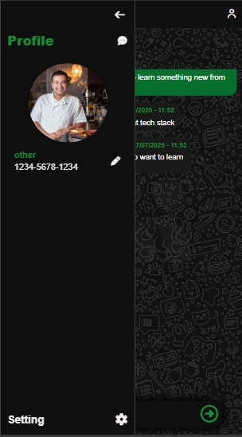
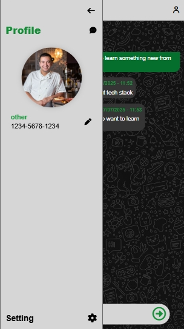
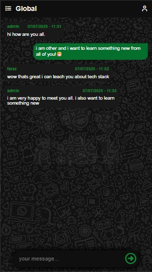
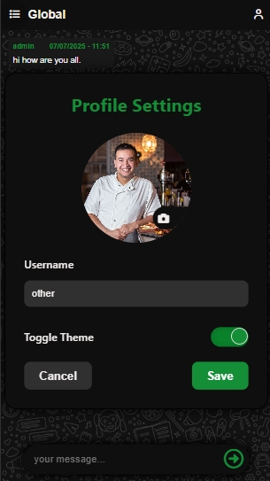

# 🚀 Real-Time Social ChatApp

A professional, full-stack real-time social chat application with modern UI/UX, user authentication, global messaging, profile upload, and WebSocket-based live chat — built for performance, scalability, and clean code architecture.



---

## 📸 Screenshots

### 🔐 Login Page



### 💬 Chat Interface


---

## 🧠 Features

-   ✅ **Real-time messaging** using WebSockets
-   🔒 **JWT-based authentication**
-   👥 **Global chat**
-   🎨 **Dark mode/ light mode toggle**
-   👤 **profile upload / browser**
-   ☎️ **add / delete Contacts**
-   ✉️ **draft messages**
-   📱 **Responsive design (Mobile + Desktop)**

## Demo Features:

### Themes:





### Responsiveness




### Profile Update Feature



---

## 🛠️ Tech Stack

### Frontend

-   **HTML5, CSS3, JavaScript**
-   **Font Awesome & custom icons**
-   **Vanilla JS (no framework)**
-   **WebSocket Client**

### Backend

-   **Node.js + Express.js**
-   **WebSocket Server (ws)**
-   **MongoDB with Mongoose**
-   **Cloudinary (media uploads)**

---

## 📁 Folder Structure

````

public/
│
├── src/
│ ├── asserts/
│ ├── constants/
│ ├── dom/
│ ├── handler/
│ ├── listeners/
│ ├── socket/
│ ├── styles/
│ ├── utils/
│ ├── login.js
│ ├── script.js
│ ├── registeration.js
│ └── socket.js
│
├── index.html
├── err.html
├── redirect.html
├── login.html
├── logout.html
├── chat.html
└── register.html

src/
├── config/
├── controller/
├── db/
├── routs/
├── utils/
├── middlewares/
├── public/
├── ws/
├── app.js
└── index.js

````
---

## ⚙️ Installation & Setup

### 1. Clone the Repo

```bash
git clone https://github.com/AdeelAhmedHashmi/universal_chatapp
cd universal_chatapp
```

### 2. Install Backend Dependencies

```bash
npm install
```

### 3. Create `.env` File

```env
PORT=5000
MONGO_URI=your_mongodb_connection_string
JWT_SECRET=your_jwt_secret
CLOUDINARY_CLOUD_NAME=your_cloud_name
CLOUDINARY_API_KEY=your_api_key
CLOUDINARY_API_SECRET=your_api_secret
```

### 4. Run the Server

```bash
npm run dev
```

### 5. Open Frontend

Open `public/index.html` in your browser or host via a simple static server.

---

## 🧪 Testing Features

-   Create multiple users (in different browsers/incognito)
-   Login and chat in real-time
-   Upload profile image.
-   Open DevTools to observe WebSocket events
-   Refresh to verify session persistence

## 🙌 Author

**Adeel Ahmed**
🧑‍💻 Web Developer | MERN Stack | Tech Explorer
🔗 [GitHub](https://github.com/AdeelAhmedHashmi)

---

## 📜 License

This project is licensed under the [MIT License](LICENSE).

---

## 💡 Want to contribute?

PRs are welcome! Feel free to fork and star ⭐ the repo.

---

## 🤝 Support

If you found this project helpful, drop a star ⭐
Have questions? DM me on GitHub or raise an issue.
